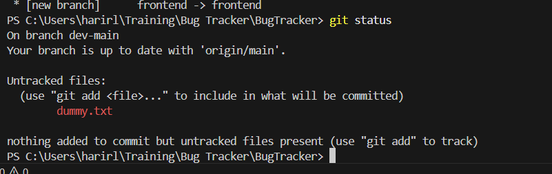
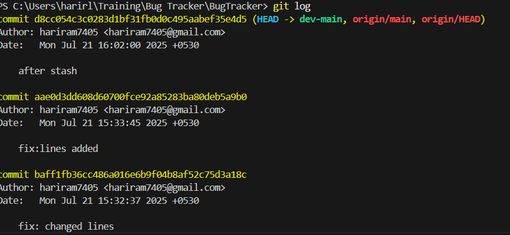

# 🐞 BugTracker

BugTracker is a simple project created for learning and practicing Git and GitHub workflows. It includes basic front-end and optional back-end files to simulate real-world version control tasks like branching, merge conflicts, stashing, resets, and more.

---

## 📌 Tasks Completed

✅ Installed and verified Git  
✅ Configured Git username and email  
✅ Created GitHub repo (`BugTracker`)  
✅ Cloned repo to local system  
✅ Verified `.git` directory  
✅ Created basic files:
- `README.md`
- `index.html`
- `style.css`
- `app.js` / `main.java` / `Program.cs`

✅ Tracked changes with **conventional commits**  
✅ Pushed changes to GitHub  
✅ Performed remote edit to trigger **merge conflict**  
✅ Resolved conflict manually  
✅ Created and pushed:
- `frontend` branch
- `backend` branch

✅ Added `.gitignore`  
✅ Practiced:
- `git stash`
- `git reset`
- `git restore`  
✅ Renamed `main` branch to `dev-main`  
✅ Viewed commit history with `git log`

---

## 🗂 Project Structure

```

BugTracker/
├── index.html         # Basic layout
├── style.css          # Basic styling
├── app.js             # Backend logic (or main.java / Program.cs)
├── README.md          # Project info
└── .gitignore         # Ignored files (node\_modules, .env, etc.)

```

---

## 🧑‍💻 Git Concepts Practiced

- Repository setup and cloning
- Staging and committing with messages
- Conventional commit types: `feat`, `fix`, `style`, `chore`
- Branching and merging
- Conflict resolution
- Stashing changes
- Resetting and restoring files
- Renaming branches
- Reviewing commit history

---

## 👨‍🏫 Author

**HARI RAM L**  
Git & GitHub Training - Day 1  
📧 hariram7405@gmail.com

---

```

## 📸 Git Screenshots

### ✅ Git Status (Merge Conflict Example)


### ✅ Git Log - Conventional Commits View


### ✅ Git Log - More Commits

